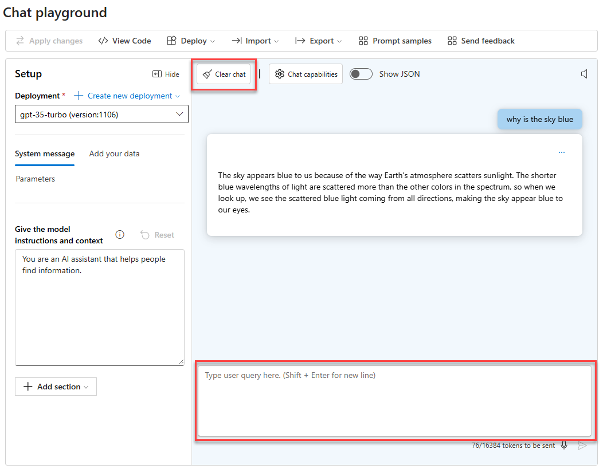

### [< Previous Challenge](./Challenge-00-Local-Dev-Env.md) - **[Home](../../README.md)** - [Next Challenge >](./Challenge-02-Semantic-Kernel.md)

# Azure AI Foundry Fundamentals

## Introduction

The first step in understanding Azure AI Foundry is to get familiar with the basics. In this challenge, you will learn about the core concepts of Azure AI Foundry and how it can be used to build powerful AI-infused applications. You will deploy a GPT-35-Turbo model and use the Azure AI Foundry Studio to interact with the model.

## Setup Azure AI Foundry

1. Navigate to [Azure AI Foundry](https://ai.azure.com) and log in with your Azure credentials
2. Deploy a ***Standard GPT-35-Turbo*** model in a region that can host GPT-35-Turbo, GPT-4.1 and DALL-E models

## Challenges



* Using the Azure AI Foundry Studio, write a user query (a prompt) to return a United States Postal Service formatted address from the following email

    ```text
        Subject: Elevate Your Brand with Our Comprehensive Marketing Solutions! 
        From: BrightEdge Marketing
        To: John Doe

        Dear John,
        At BrightEdge Marketing, we believe in the power of innovative marketing strategies to elevate brands and drive business success. Our team of experts is dedicated to helping you achieve your marketing goals through a comprehensive suite of services tailored to your unique needs.

        Please send letters to 123 Marketing Lane, Suite 400 in area 90210 located in Innovation City California.

        Thank you for considering BrightEdge Marketing.
        Best regards,
        Sarah Thompson 
        Marketing Director BrightEdge Marketing

    ```

* Click `Clear Chat` and using the same email from the previous challenge, craft a prompt to rewrite the email and replace any PII with the string `[REDACTED: category]` where category is the PII category found in the email.

* Click `Clear Chat` and enter the following prompt into the Azure AI Foundry and observe the results
    :exclamation:Before updating the prompt, clear the current chat history so the AI doesn't consider its previous answers when responding to the new prompt.

    ```text
    A coin is heads up. Maybelle flips the coin over. Shalonda flips the coin over. Is the coin still heads up? 
    ```

    The answer, of course, should be `Yes, the coin is heads up` but the AI is likely to answer `No` because it does not always follow state changes correctly. Rewrite the prompt convincing the AI to keep track of state changes to successfully answer the question with a `Yes`.

    > Note: We intentionally use the Standard GPT-35-Turbo model for this exercise. GPT-4o often tracks the state correctly for this prompt by default, while GPT-35-Turbo does not. This contrast helps teach prompt engineering techniques to explicitly instruct the model to maintain and update state across the steps.

    > Troubleshooting: If the model answers "Yes" immediately without additional guidance, first try the prompt exactly as written (the weak prompt) and observe any mistakes. Then rewrite it with explicit state-tracking instructions (e.g., “treat the coin’s facing as a state variable; update it after each action; then answer only with Yes/No”) to see how the results improve.

## Success Criteria

1. Verify that you deployed a Standard GPT-35-Turbo model using Azure AI Foundry.
1. Verify that you can access the Azure AI Foundry Studio and create a new chat.
1. Verify that you can craft a prompt to return a United States Postal Service formatted address from the provided email
1. Verify that you can craft a prompt to rewrite the email and replace any PII with the string `[REDACTED: category]`
1. Verify that you can craft a prompt to compel the AI to keep track of state changes

## Learning Resources

[QuickStart: Get started using GPT-35-Turbo with Azure AI Foundry Service](https://learn.microsoft.com/en-us/azure/ai-services/openai/chatgpt-quickstart?tabs=command-line%2Cpython-new&pivots=programming-language-studio)

[Azure AI Foundry Models](https://learn.microsoft.com/en-us/azure/ai-services/openai/concepts/models)

[Intro to Prompt Engineering](https://learn.microsoft.com/en-us/azure/ai-services/openai/concepts/prompt-engineering)

[Prompt engineering techniques](https://learn.microsoft.com/en-us/azure/ai-services/openai/concepts/advanced-prompt-engineering?pivots=programming-language-chat-completions#prime-the-output)

[Chain of Thought Prompting](https://learn.microsoft.com/en-us/azure/ai-services/openai/concepts/advanced-prompt-engineering?pivots=programming-language-chat-completions#chain-of-thought-prompting)

### [< Previous Challenge](./Challenge-00-Local-Dev-Env.md) - **[Home](../../README.md)** - [Next Challenge >](./Challenge-02-Semantic-Kernel.md)
