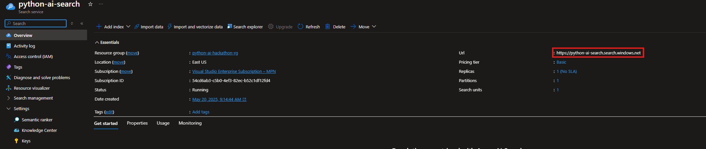
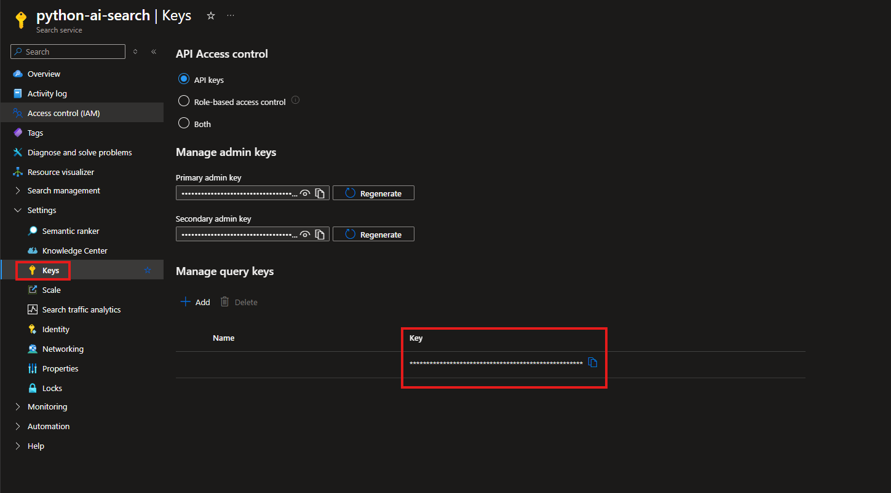
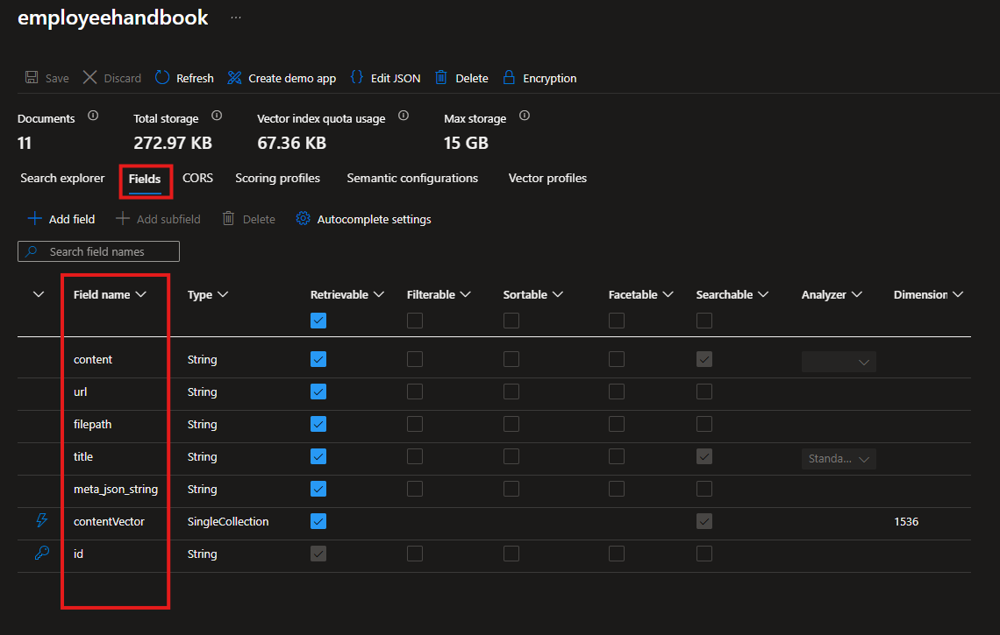

### [< Previous Challenge](./Challenge-03-SK-Plugins.md) - **[Home](../../README.md)** - [Next Challenge >](./Challenge-05-Multi-Agent.md)

# RAG Pattern with Azure AI Search

## Introduction

Contoso’s HR team needs the chatbot to answer questions that live only in the employee handbook—there’s no public API they can call. Rather than hard-code responses, you’ll extend the plugin system you built in Challenge 03 so the assistant can search those internal documents on demand.

Retrieval Augmented Generation (RAG) solves this by combining fast document retrieval with powerful generative models. After you surface the right handbook context, the chat model can ground its answer in that source instead of guessing.

RAG is an AI architecture pattern that combines retrieval mechanisms with generative AI models to produce more accurate, relevant, and contextually-appropriate responses. In a RAG system, when a query is received, the system first retrieves relevant information from a knowledge base or external data source. This retrieved information is then used to augment or condition the input to a generative AI model, enhancing its ability to provide accurate and comprehensive responses.

The RAG pattern is particularly valuable because it addresses two key limitations of large language models (LLMs): their potential to produce factually incorrect information (hallucinations) and their reliance on the data they were initially trained on, which may become outdated. By retrieving and incorporating up-to-date, relevant information from external sources, RAG systems can provide more current and accurate responses.

In RAG systems, the retrieval component typically involves searching a database, knowledge base, or other structured or unstructured data source to find information relevant to a given query. This retrieval can be based on traditional search techniques, keyword matching, or more sophisticated methods like semantic or vector search, which aim to capture the meaning behind the query rather than just matching specific terms.

The retrieved information is then fed into the generative model as conditioning context along with the original query. This additional context helps the model to generate a response that is not only conversationally appropriate but also grounded in the retrieved information. The generative model might directly incorporate facts from the retrieved documents, paraphrase them, or use them as a reference to ensure the coherence and factual accuracy of its output.

For instance, if a user asks about a company's employee safety policy, a RAG system might first retrieve specific company safety documents that mention safety protocols. The generative model could then use this information to provide an accurate response that reflects the company's specific policies, rather than providing generic information about safety practices or making unsupported assertions about the company's policies.

#### :exclamation:**IMPORTANT - Privacy and Security**

Your prompts (inputs), completions (outputs), embeddings, and training data are:

* NOT available to other customers.
* NOT available to OpenAI.
* NOT used to improve OpenAI models.
* NOT used to improve any Microsoft or 3rd party products or services.
* NOT used for automatically improving Azure AI Foundry models for your use in your resource (The models are stateless, unless you explicitly fine-tune models with your training data).

> Your fine-tuned Azure AI Foundry models are available exclusively for your use.
The Azure AI Foundry Service is fully controlled by Microsoft; Microsoft hosts the OpenAI models in Microsoft's Azure environment and the Service does NOT interact with any services operated by OpenAI (e.g. ChatGPT, or the OpenAI API).

For more information on Data, privacy, and security for Azure AI Foundry Service visit this [Link](https://learn.microsoft.com/en-us/legal/cognitive-services/openai/data-privacy)

### Embeddings in AI

Embedding models are a way to represent complex data, like words or images, as numbers so that computers can understand and work with them more easily.

#### Here's a simple breakdown

**Representation**: Imagine you have words like "cat," "dog," and "apple." In an embedding model, each word is represented by a list of numbers (like coordinates in a space). For example, "cat" might be represented as [0.2, 0.5, 0.8] and "dog" as [0.3, 0.4, 0.9]. These numbers capture the meaning of the word in a way that the computer can process.

**Similarity**: Words with similar meanings will have similar numbers (or be close to each other in this space). For example, "cat" and "dog" might be close together, while "apple" would be farther away.

**Training**: To create these embeddings, the model is trained on lots of text. It learns patterns and relationships between words based on how they are used together. Once trained, it can represent any word as a list of numbers.

**Usage**: These embeddings are used in tasks like translating languages, finding similar items (like in a recommendation system), or even understanding sentences.

In essence, embedding models take something complex (like words or images) and turn them into a simple, consistent format (numbers) that machines can work with. In your plugin, these embeddings let Azure AI Search understand the intent behind “Who approves remote work?” and match it to the correct handbook passages even when the wording differs.

### Document Chunking

Document chunking is a technique used in AI, especially in Retrieval-Augmented Generation (RAG) models, to break down large documents into smaller, manageable pieces or "chunks." This makes it easier for the AI to process the relevant information. Imagine you have a long book and you want to find specific information quickly. Instead of reading the entire book, you divide it into chapters or sections. Each chunk can then be indexed and searched individually, making the retrieval process faster and more efficient.

In the context of RAG, these chunks are used to enhance the AI's ability to generate accurate and contextually relevant responses. When a query is made, the retrieval mechanism searches through these smaller chunks to find the most relevant information, which the model then uses to generate a coherent and informative answer. This method improves the performance and accuracy of AI models by ensuring they have access to the most pertinent data without being overwhelmed by the volume of information. For the Contoso handbook, chunking ensures the search results come back as precise policy snippets that the chatbot can cite in its response.

In this challenge, you will create a Semantic Search Plugin that utilizes an Azure AI Search Index to retrieve information from the Contoso Handbook PDF. The purpose of the plugin is to enable the AI Model to answer questions about your own documents. We achieve this by converting the user's query into an embedding using a Text Embedding model. The embedding is then used to search the AI Search Index for the most relevant information.

Together, chunked handbook content indexed with embeddings makes it possible for your RAG plugin to retrieve grounded data and feed it into the chatbot—bridging the gap when no API exists.

## Prerequisites

- Completed at least [Challenge 03](./Challenge-03-SK-Plugins.md) and have the reference application running locally.
- Access to an Azure subscription or pre-deployed workshop environment that can host Azure AI Search, Azure Storage, and Azure AI Foundry resources.
- A deployed text embedding model (for example, `text-embedding-ada-002`) available in Azure AI Foundry.
- An Azure AI Search index named `employeehandbook` containing the Contoso Handbook data.

> **Setup Guide:** If you still need to provision Azure AI Search or import the handbook data, follow [`Resources/Supporting Challenges/Setup-RAG.md`](../Resources/Supporting%20Challenges/Setup-RAG.md) before proceeding.

With these prerequisites met, you're ready to capture the connection details from your Azure AI Search resource.

## Objectives

* Connect to Azure AI Search
* Use AI Foundry to connect to a Text Embedding model
* Create a Semantic Search Plugin to query the AI Search Index

## Getting your URL, Key and Index Name

1. Your search index name will be `employeehandbook`, put that in your .env file

1. To get your AI Search URL and Key navigate to [the azure portal](https://portal.azure.com)

1. Then in the search bar, search for "AI Search" and click on the first result

1. Click on the only AI search resource listed

1. You'll find your URL in the overview section

    

1. Copy that URL into your .env file

1. Then expand the "Settings" section and click on "Keys"

    

1. Copy the query key into your .env file

### Create a Semantic Search Plugin to query the AI Search Index

1. Navigate back to the reference application and open the **chat.py** file. Register the service for Azure AI Foundry Text Embedding Generation with the Kernel.

    :bulb: As an example, look at how you registered the `AzureChatCompletion` service. That code reads the following settings from your `.env` file:

    - `AZURE_OPENAI_CHAT_DEPLOYMENT_NAME`
    - `AZURE_OPENAI_ENDPOINT`
    - `AZURE_OPENAI_API_KEY`

    For the embeddings service you are adding now, make sure your `.env` also includes:

    - `AZURE_OPENAI_EMBEDDING_DEPLOYMENT_NAME`

1. We will be using the *Azure AI Search Vector Store connector*. The plugin has already been provided for you in your plugins folder.

     >This is the Semantic Search Plugin to query the AI Search Index created earlier. This Plugin should take the users query and generate an embedding using the Text Embedding model. The embedding should then be used to query the AI Search Index containing the Contoso Handbook PDF and return the most relevant information.

    :bulb: Note the Azure AI Search settings expected in your `.env` file:

    - `AZURE_AI_SEARCH_ENDPOINT`
    - `AZURE_AI_SEARCH_API_KEY`
    - `AZURE_AI_SEARCH_INDEX_NAME`

1. The Sample RAG Plugin in the documentation maps the incoming data from AI Search to a class named `EmployeeHandbookModel`.

    The properties on this class map to fields in the AI Search Index we created earlier. In the portal, you can navigate to the AI Search Index and see the fields that are available.

    

1. Add the plugin to Semantic Kernel in chat.py

    Below is the workflow handled by Semantic Kernel and your plugin:

    ```mermaid
    sequenceDiagram
        participant C as Client
        participant S as Semantic Kernel
        participant A as AI
        box Contoso Search Plugin 
            participant P as Plugin
            participant E as Embedding
            participant Search as Azure AI Search
        end
        C->>S: What are the steps for the Contoso Performance Reviews?
        activate C
        S->>+A: What are the steps for the Contoso Performance Reviews?
        A-->>-S: Call contoso_search function
        S->>+P: Query: Steps for the Contoso Performance Reviews?
        P->>+E: Convert query to Embedding
        E-->>-P: Embedding [19,324,12,.......]
        P->>+Search: Search Documents using Embedding
        Search-->>-P: Related Documents
        P-->>-S: Here are the related documents
        S->>+A: Results of contoso_search
        A-->>-S: The steps for the Contoso Performance Reviews are ...
        S->>C: Here are the steps for the Contoso Performance Reviews
        deactivate C
    ```

1. Test the Plugin

    Set a breakpoint in your plugin to verify that the Contoso search function is being called correctly. Review the incoming query, the generated embedding, and the search results returned from the AI Search Index.

    Test the plugin by running the applications and asking the Chatbot questions about the Contoso Handbook. The Chatbot should be able to answer questions similar to the following:

    * ```text
        What are the steps for the Contoso Performance Reviews?
       ```

    * ```text
        What is Contoso's policy on Data Security?
      ```

    * ```text
        Who do I contact at Contoso for questions regarding workplace safety?
      ```

## Understanding Retrieval Augmented Generation (RAG)

The following diagram illustrates how the RAG pattern works with Azure AI Search to enhance AI responses with custom knowledge:

```mermaid
%%{init: {'theme': 'dark', 'themeVariables': { 'primaryColor': '#242424', 'primaryTextColor': '#fff', 'primaryBorderColor': '#555', 'lineColor': '#555', 'secondaryColor': '#444', 'tertiaryColor': '#333'}}}%%
flowchart LR
    classDef indexClass fill:#4B6BFD,stroke:#333,stroke-width:1px,color:white
    classDef queryClass fill:#28A745,stroke:#333,stroke-width:1px,color:white
    classDef userClass fill:#6F42C1,stroke:#333,stroke-width:1px,color:white
    classDef resultClass fill:#E83E8C,stroke:#333,stroke-width:1px,color:white
    
    subgraph Indexing["Document Processing (Before Query Time)"]
        direction LR
        I1[Document intake]:::indexClass --> I2[Split into chunks]:::indexClass
        I2 --> I3[Generate embeddings]:::indexClass
        I3 --> I4[Store in vector DB]:::indexClass
    end
    
    subgraph Querying["Query Processing (At Runtime)"]
        direction LR
        Q1[User query]:::userClass --> Q2[Convert to embedding]:::queryClass
        Q2 --> Q3[Search vector DB]:::queryClass
        Q3 --> Q4[Retrieve relevant chunks]:::queryClass
        Q4 --> Q5[Add chunks to prompt]:::queryClass
        Q5 --> Q6[Send to AI model]:::queryClass
        Q6 --> Q7[Generate enhanced response]:::resultClass
        Q7 --> Q8[Display to user]:::userClass
    end
    
    I4 -.->|Vector similarity search| Q3
```



This diagram shows the complete RAG workflow:

1. **Document Processing (Done before query time)**
   - Documents are ingested
   - Split into smaller chunks
   - Each chunk is converted into a vector embedding
   - These embeddings are stored in the Azure AI Search vector database

2. **Query Processing (At runtime)**
   - User asks a question
   - The question is converted to a vector embedding
   - This embedding is used to search the vector database for similar content
   - The most relevant document chunks are retrieved
   - The retrieved chunks are combined with the original query
   - This enhanced prompt is sent to the AI model
   - The model generates a response that incorporates specific knowledge from the documents
   - User receives an accurate answer grounded in your organization's data

The RAG pattern ensures responses are factual, up-to-date, and relevant to your specific organization, eliminating "hallucinations" and providing access to information not in the model's original training data.

## Success Criteria

1. Verify that you deployed the text-embedding-ada-002 Text Embedding model in Azure AI Foundry
1. Verify that you deployed an AI Search Index and imported the Contoso Handbook PDF
1. Verify that the Chatbot is able to answer questions about the Contoso Handbook by querying the AI Search Index using the Semantic Search Plugin

## Additional Learning Resources

* [Semantic Kernel Blog](https://devblogs.microsoft.com/semantic-kernel/)
* [ChatGPT + Enterprise data with Azure AI Foundry and Cognitive Search](https://github.com/Azure-Samples/azure-search-openai-demo)
* [Build Industry-Specific LLMs Using Retrieval Augmented Generation](https://towardsdatascience.com/build-industry-specific-llms-using-retrieval-augmented-generation-af9e98bb6f68)

## Advanced Challenges (Optional)

**These are optional challenges for those who want to further explore the capabilities of Semantic Search and plugins.**

* Delete the AI Search Index and re-upload the Employee Handbook PDF changing the **chunk size**. Experiment with different chunk sizes and see how it affects the search results.
* Update the Semantic Search Plugin to return the top 3 most relevant search results, instead of just the top result.

### [< Previous Challenge](./Challenge-03-SK-Plugins.md) - **[Home](../../README.md)** - [Next Challenge >](./Challenge-05-Multi-Agent.md)
