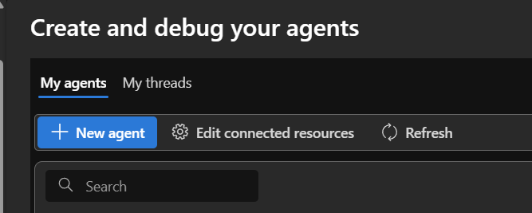
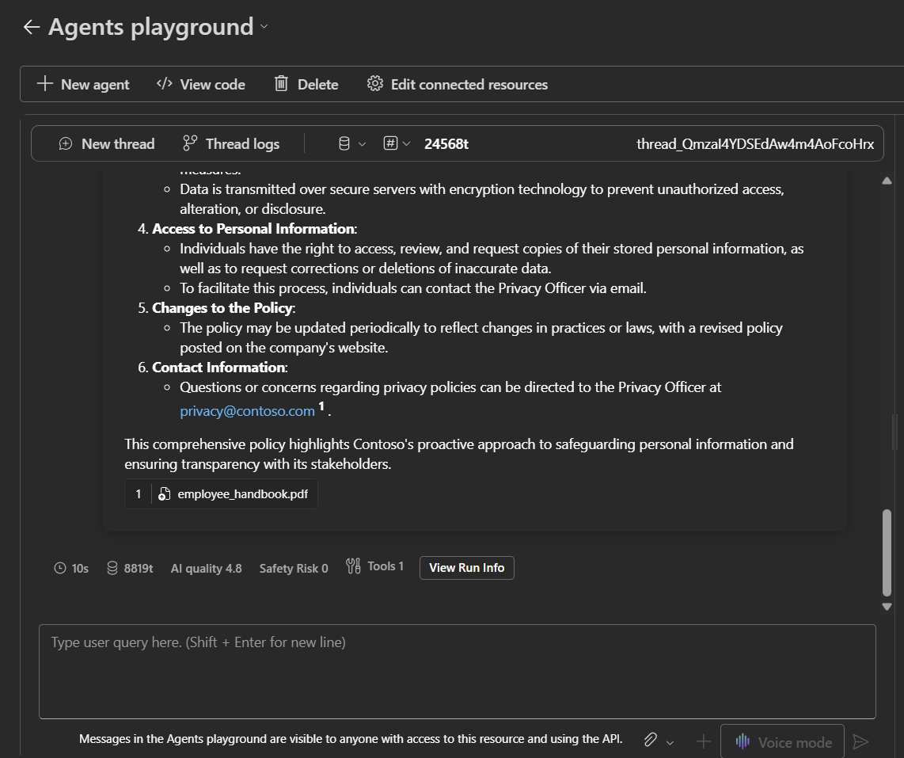
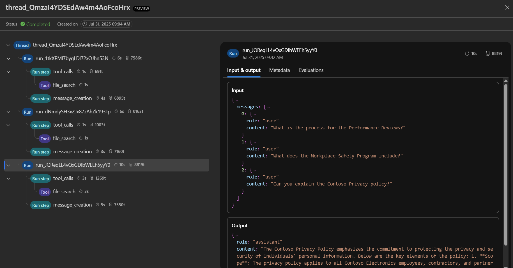

### **[Home](../../README.md)** 

# Tracing Agent Threads in the Azure AI Foundry Agent Playground

## Introduction

Understanding why your agents execute tasks is invaluable for model selection, troubleshooting, and debugging.  Agent complexity can influence our ability to assess workflows, as the number of steps, their sequencing, their depth, and their overall complexity can obfuscate the insights we're trying to get to evaluate our application's efficiency.

Agent Tracing in the Azure AI Foundry Agents Playground remedies this by allowing us to trace threads and runs that our agents produce.  This allows us to see information regarding tool calls, steps performed, and other insights within the thread context.  It also provides valuable information via optional automatic evaluations for AI quality and Risk Safety and token usage

## Create an Agent in the Azure AI Foundry Portal

1. Navigate to  [Azure AI Foundry](https://ai.azure.com) and login with your Azure credentials.
2. Within your AI Foundry project, select ***Agents*** from the left-hand menu.  If you do not see ***Agents*** as an available selection, scroll the left-hand toolbar to the bottom and select ***More*** and make sure Agents is pinned.
3. Click the ***New agent*** button, which will open the Agent Setup interface on the right-hand side.      
    
    * Select your model deployment from the drag down box labeled ***Deployment*** 
    * After selecting your model deployment, enter a unique name that you can recognize in the ***Agent name*** text box.
    * In the ***Instructions*** text box, enter the following prompt:
    ```text
    You are a helpful AI agent that assists with answering questions about the Contoso handbook.
    ```
    * After you have entered the prompt, navigate to the ***Knowledge*** section of the interface and click the ***+ Add*** button.  Then select ***Files*** and upload the file ***employee_handbook.pdf***, which can be found in the ***Python/src/data*** folder.  If the file has already been uploaded, you can use ***Select an existing vector store*** from the drag down menu and select the vector store for the file.  
    * After you have added the ***employee_handbook.pdf*** (or selected the existing vector if the file had previously been uploaded), click the ***Try in playground*** button at the top of the Agent Setup interface.


## Challenges 

1. In the Agent playground, take a few moments to familiarize yourself with the interface and ask the agent some questions.

    * Towards the top of the interface, you'll see the ***</>View code*** button.  This shows the code that can be used with the Foundry SDK to use agents created in the AI Foundry portal in your code.
    * Notice that the icons next to the ***Thread logs*** button allow you to modify the capabilities for the agent.  You can add files to alter the knowledge and capabilities of the agent within the thread via ***Thread files***, and you can modify which automatic evaluators are measured for the agent using the ***Metrics*** button.  To the right of these buttons, you can see the number of tokens used so far in the thread. 

2. Use the text prompt at the bottom of the screen to ask the agent the following questions about the Contoso Employee Handbook.  Wait for the response for each question before proceeding to the next question:

    ```text
    What does the Workplace Safety Program include?
    ```

    ```text
    Can you explain the Contoso Privacy policy?
    ```

3. After you have finished asking the agent questions about the Contoso handbook, click the ***Thread logs*** button at the top of Agents playground interface.

* Notice that each individual section will denote the amount of time the agent took to complete the action/step, and the number of tokens used.
* The ***Thread*** section designates which thread context the trace is evaluating.
    * Each ***Run*** section shows us data for inputs and outputs, metadata for the run itself, and results for the automated evaluations that occur with each run.  In the context of this challenge, each ***run*** will reference the question it asks, as well as the previous questions asked within the same thread.
        * Within the run, the ***Run step*** will contain information about actions the agent took within the run, such as tool calls or submitting outputs.
            * Within a tool call, the ***Tool*** section will show information on inputs and outputs and metadata for the tool calls used, their types and kinds, and different attributes.  In the context of this challenge, each ***Tool*** section refers to the agent using a tool call to perform the ***"file_search"*** action, where it searches through the contents of the vector store of the ***employee_handbook.pdf*** file.
            * For ***message_creation*** run steps, the agent role and its outputs are displayed in the ***Input & output*** section.  More information on the message creation can be found in the ***Metadata*** section.
            



## Success Criteria
1. Verify that you have successfully created an agent, and are able to use the Agents Playground to test its functionality.
2. Verify that you are able to view each of the different sections and information provided in the Thread Logs.
3. Verify that you are able to view how long each action/step took your agent to perform.
4. Verify that you are able to view the number of tokens used during each action/step.


## Learning Resources

[Tracing Agents](https://learn.microsoft.com/en-us/azure/ai-foundry/agents/concepts/tracing)

[Threads, Runs, and Messages in Azure AI Foundry Agent Service](https://learn.microsoft.com/en-us/azure/ai-foundry/agents/concepts/threads-runs-messages)

[What is Azure AI Foundry Agent Service?](https://learn.microsoft.com/en-us/azure/ai-foundry/agents/overview)


### **[Home](../../README.md)** 