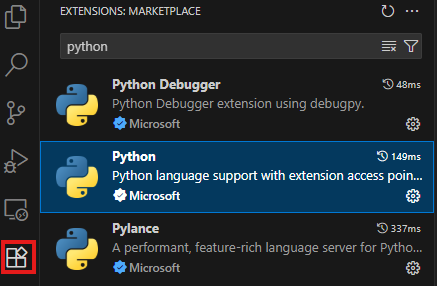
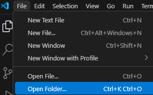
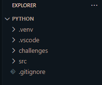
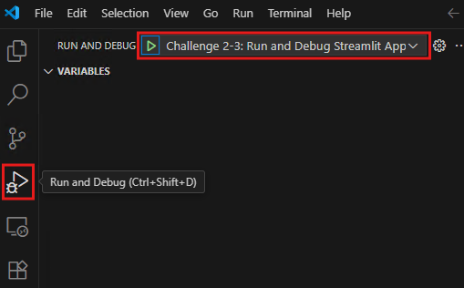
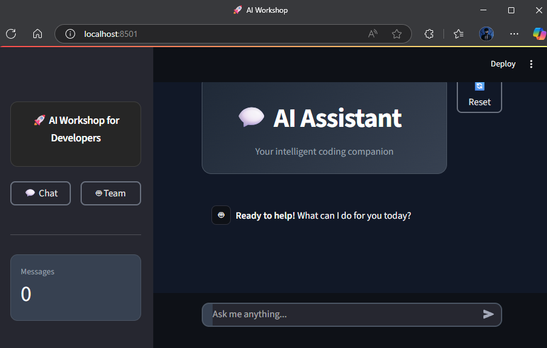
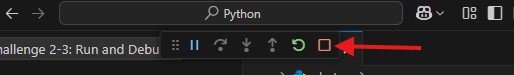

### **[Home](../../../../README.md)**

## Prerequisites - Ready, Set, GO!

Thank you for participating in the OpenAI & Semantic Kernel Fundamentals. Before you can workshop, you will need to set up some prerequisites.

### Access Azure AI Foundry

You will need access to [Azure AI Foundry](https://ai.azure.com/)

### Development Environment

You will need a development environment to complete the challenges.

You will need to set up the necessary tools and resources on your local workstation to complete the challenges and will need to clone this Git Repository to your local workstation.

#### Ensure the following tools are installed on your Local Workstation:

- [VS Code](https://code.visualstudio.com/download)
- [VS code Python Extension](https://code.visualstudio.com/docs/languages/python)
- [Git CLI](https://git-scm.com/downloads) or [GitHub Desktop](https://github.com/apps/desktop)

<!-- **Note:** GitHub Copilot is a great tool to help you write code faster. You can install the [GitHub Copilot Extension](https://marketplace.visualstudio.com/items?itemName=GitHub.copilot) in Visual Studio Code. We highly recommend you install this extension to help you complete the challenges.

If you do not have GitHub Copilot, you can still complete the challenges. However you can start a free trial of GitHub Copilot by following the instructions [here](https://github.com/features/copilot?ef_id=_k_fdbe5318644f1533620435c241c3e251_k_&OCID=AIDcmmb150vbv1_SEM__k_fdbe5318644f1533620435c241c3e251_k_&msclkid=fdbe5318644f1533620435c241c3e251). -->

### Setting up VS code

1. Install [VS Code](https://code.visualstudio.com/download) and [Git CLI](https://git-scm.com/downloads) or [GitHub Desktop](https://github.com/apps/desktop)

    Download the installer for your OS and follow the installer's instructions.

1. Clone the [git repository](https://github.com/kizantech/AIDeveloperInADay.git). You can do this by running the following command in your terminal or command prompt:

    ```console
    git clone https://github.com/kizantech/AIDeveloperInADay.git
    ```

1. Open VS code
1. Ensure the Microsoft Python Extension is installed: 
  
    Go to Extensions and search for `Python`.

    

    If it's not already installed, click install. 
1. In the top left hand corner, click on `File` and then `Open Folder`

    

    Navigate to where you cloned the git repository

    Open the folder `AIDeveloperInADay` and then select the folder `Python` and open it

    Make sure in VS code, your explorer looks similar to this

    

1. **Install Python Dependencies**
  
    Before you can run the application, you **must** install the required Python packages. The application will not work without these dependencies.

    It is **highly recommended** that you create a Python virtual environment for your packages. If you do not do this you will need to update the launch.json file in the .vscode folder to point to your python installation.

    **Creating your Python virtual environment**
    1. Open your terminal or command prompt
    2. Navigate to the `Python` directory in your terminal/command prompt
    3. Run the following command to create the virtual environment: `python -m venv <virtual environment name>`
    4. Then activate the virtual environment: `.\<name of your virtual environment>\Scripts\activate`
    5. Proceed with installing your requirements
    6. To deactivate your virtual environment: `.\<name of your virtual environment>\Scripts\deactivate`

    **Using VS Code (Recommended):**
    1. Open the integrated terminal in VS Code (`Terminal` → `New Terminal` or `` Ctrl+` ``)
    2. Make sure you're in the `src` directory: `cd src`
    3. Install the requirements: `pip install -r requirements.txt`

    **Using Command Line:**
    1. Navigate to the `src` directory in your terminal/command prompt
    2. Run: `pip install -r requirements.txt`

    **Troubleshooting:**
    - If you see permission errors, you may need to activate your virtual environment first
    - On Windows, you might need to use `python -m pip install -r requirements.txt`
    - The installation may take a few minutes as it downloads Semantic Kernel and other dependencies

1. Check your Run and Debug menu to make sure VS code detected the launch profiles

    

1. Run the launch profile `Challenge 2-3`

    That should launch the web chat app in your default browser and look something like this

    

1. To stop the application press the small red square in the debug bar along the top of your screen

    


## Success Criteria

- Verify that you have **Visual Studio Code** with ***Python*** extension installed.
- Verify you have the following files & folders locally:

  ```text
  ├─ python
      └── .vscode
      └── src
        └─── plugins
        └─── workitems
        └─── chat.py
        └─── app.py
        └─── requirements.txt

- Verify that you have the launch profiles in your Run and Debug menu
- Verify that you were able to access the web page