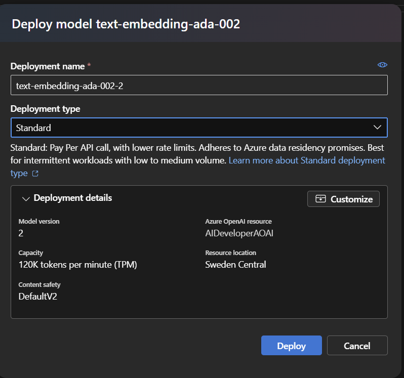
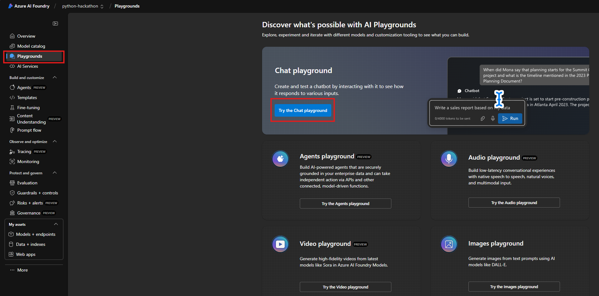
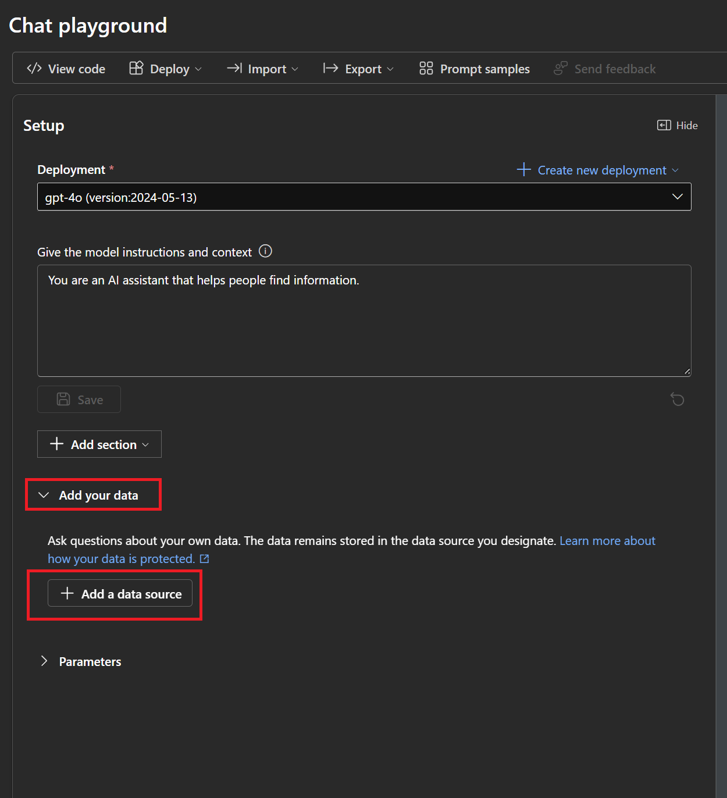
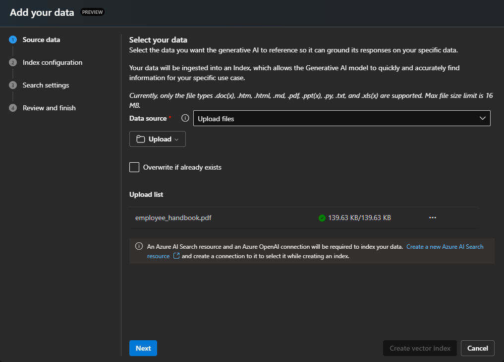
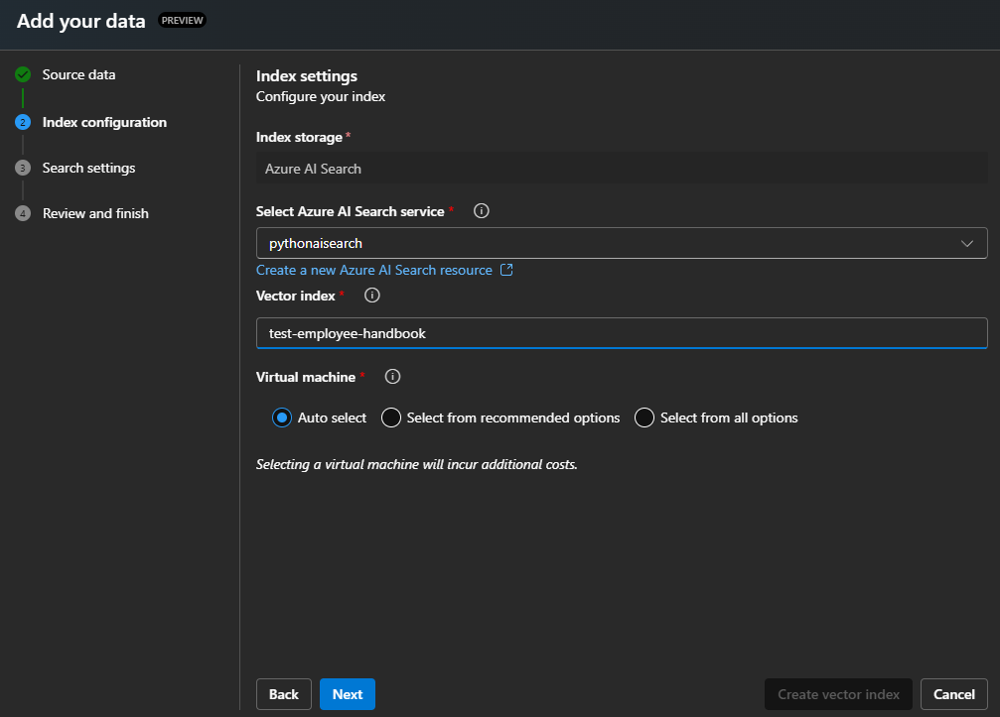

### Deploy Azure AI Search

1. In the [Azure Portal](https://portal.azure.com/) search for ```AI Search``` and select **Create**.
    1. Create it in the **same resource group and location as your AI Models**.
    1. Change the pricing tier to **Basic**.
    1. Leave everything else as default, then click **Review + create**.

1. Once the AI Search resource is created, navigate to the resource.
    1. Grab the **URL** from the Overview section.
    1. Grab the **Key** from the Keys section.

### Deploy Storage Account with CORS enabled

1. In the [Azure Portal](https://portal.azure.com/) search for ```Storage Account``` and select **Create**.
    1. Create it in the **same resource group and location as your AI Models**.
    1. Leave everything as default, then click **Review + create**.
1. Once the Storage Account is created, navigate to the resource. Reference this screenshot for the CORS settings below.
    1. Under the **Settings** section, click on **Resource sharing (CORS)**.
    1. Add 2 rows with the following values:
        1. Row 1:
            * Allowed origins: ```https://documentintelligence.ai.azure.com```
            * Allowed methods: ```Select All```
            * Allowed headers: ```*```
            * Exposed headers: ```*```
            * Max age: ```120```
        1. Row 2:
            * Allowed origins: ```https://ai.azure.com```
            * Allowed methods: ```GET, POST, OPTIONS, and PUT```
            * Allowed headers: ```*```
            * Exposed headers: ```*```
            * Max age: ```120```

            :bulb: If you are using AI Studio instead of Azure AI Foundry Studio, you will need to change the origin to ```https://ai.azure.com```.

    1. Click **Save**.

    

### Use AI Foundry to deploy a Text Embedding model

1. Using [Azure AI Foundry](https://ai.azure.com/resource/deployments), deploy a *Standard* **text-embedding-ada-002** model in the same deployment as your previous GPT-4o model. 

    

## Environment Setup

Now that you have deployed all the necessary resources, you'll need to update your `.env` file with the appropriate configuration settings.

1. Review the list of required environment variables for Azure AI Search and Text Embeddings by checking the [Semantic Kernel Environment Settings documentation](https://github.com/microsoft/semantic-kernel/blob/main/python/samples/concepts/setup/ALL_SETTINGS.md).

2. Add the necessary environment variables to your existing `.env` file. The variables should include settings for:
   - Azure AI Search configuration
   - Text Embedding model configuration

Ensure all required settings are properly configured before proceeding to the next step.

> **Hint:** Look for settings related to Azure AI Search and Text Embeddings in the documentation. You'll need to add settings for the endpoint, API key, index name, and embedding model deployment.

### Import documents

1. In Azure AI Foundry click on Playground -> Chat Playground

    

1. Ensure the correct model is selected under Deployment. Then click the drop down Add your data -> Add new data source

    

1. Select Data Source = ```Upload Files```.

    

1. Choose the **AI Search Resource** setup in the previous step.
1. For the Index Name use:

    ```text
    employeehandbook
    ```

    > :bulb: The AI Search Index Name will be needed by the reference application

1. Click Next

    

1. Check **Add Vector Search**
1. Select your Azure OpenAI connection
1. Select the **text-embedding-ada-002** model
1. Select your **text-embedding-ada-002** model deployment that was created previously

  <!-- > :bulb: Chunk size refers to how much text is grouped together into a single segment or "chunk" before creating an embedding. When processing large documents, the text is often divided into smaller chunks to create embeddings for each segment. The chunk size determines how much text is included in each embedding.
  >
  > Choosing the right chunk size is important: if chunks are too large, important details might get lost or diluted in the embedding; if too small, the system might miss out on essential context. The chunk size thus impacts the accuracy and relevance of the information retrieved and subsequently used in generating responses

   -->
<!-- 
1. Set the Resource Authentication Type to **API Key**

    

    :repeat: Click **Next** and wait for the import to finish -->
